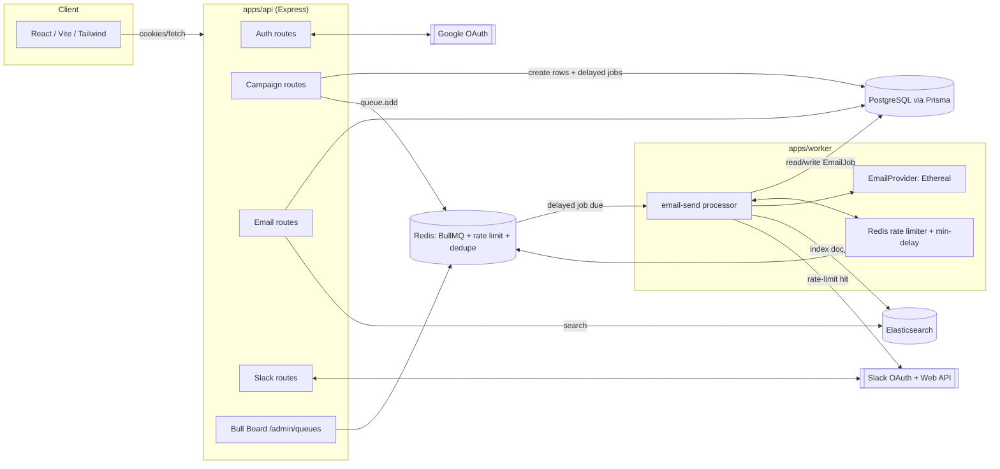

# Email Job Scheduler

A production-style, full-stack email campaign scheduler (a small slice of a ReachInbox-style
product) built as a hiring/internship assignment. Real Google OAuth, real Slack OAuth + Web API
notifications, BullMQ + Redis for durable scheduling, Postgres as the source of truth,
Elasticsearch for search, and Bull Board for queue observability.

**No cron jobs are used anywhere in this project.** All scheduling is done with BullMQ delayed
jobs backed by Redis.

---

## 1. Project overview

Users sign in with Google, connect Slack (optional), compose an email campaign by uploading a
CSV/TXT of recipients, choose a sender, a start time, a delay between sends, and an hourly cap,
and schedule it. The system fans that campaign out into individually delayed, idempotent,
rate-limited BullMQ jobs, each backed by a durable Postgres row. A worker process executes them
against Ethereal SMTP, respects per-sender hourly limits and a global minimum send delay (both
enforced atomically across worker processes via Redis), reschedules (never drops) anything over
the limit, and notifies the user's Slack channel when that happens. Sent/scheduled emails are
listed and searchable (via Elasticsearch) in a React dashboard.

## 2. Features

- Google OAuth login, session via httpOnly JWT cookie
- Dashboard: avatar/name/email, logout, Slack connect/disconnect
- Compose modal: sender, subject, body, CSV/TXT upload with live valid-recipient count, start
  time, delay, hourly limit
- BullMQ-backed scheduling with deterministic, idempotent job IDs
- Distributed per-sender hourly rate limiting (Redis, atomic)
- Distributed minimum send-delay enforcement (Redis, atomic)
- Automatic reschedule-not-drop when a sender hits its hourly cap, with a deduped real Slack alert
- Scheduled/Sent email tables with status, pagination, loading/empty/error states
- Elasticsearch-backed search over recipient/subject, scoped to the logged-in user
- Bull Board at `/admin/queues`, gated behind auth + an admin allow-list
- Restart-safe: Redis (AOF) + Postgres persist state across API/worker restarts

## 3. Architecture

```
Browser (React/Vite/Tailwind)
   |  cookies (httpOnly JWT), fetch()
   v
apps/web  --HTTP-->  apps/api (Express)
                         |
                         |--> PostgreSQL (Prisma)   -- source of truth
                         |--> Redis                 -- BullMQ + rate-limit + dedupe keys
                         |--> Elasticsearch          -- search index (best-effort)
                         |--> Google OAuth2 / Slack OAuth2 (external)
                         `--> Bull Board (/admin/queues, session + admin-list protected)

apps/worker (separate Node process, same codebase)
   |
   |--> consumes BullMQ queue "email-send"
   |--> reads EmailJob from Postgres (source of truth)
   |--> Redis Lua scripts: hourly rate limit + min-delay coordination
   |--> EmailProvider abstraction -> Nodemailer/Ethereal
   |--> updates Postgres + Elasticsearch on completion
   `--> Slack Web API notification on rate-limit hit (deduped via Redis)
```

The worker is a **separate process** from the HTTP API (own entrypoint, own `npm run dev:worker`),
so it scales and restarts independently.

## 4. Architecture diagram (Mermaid)



## 5. Technology stack

| Layer | Technology |
|---|---|
| Frontend | React, TypeScript, Vite, Tailwind CSS |
| Backend | Node.js, Express, TypeScript |
| Database | PostgreSQL + Prisma ORM |
| Queue | BullMQ + Redis |
| Search | Elasticsearch |
| Email | Nodemailer + Ethereal SMTP |
| Auth | Google OAuth 2.0, JWT (httpOnly cookie) |
| Chat ops | Slack OAuth 2.0 + Slack Web API |
| Infra | Docker Compose (Postgres, Redis, Elasticsearch) |
| Queue monitoring | Bull Board |

## 6. Folder structure

```
/
  apps/
    api/                # Express API + BullMQ worker (same package, two entrypoints)
      prisma/schema.prisma
      src/
        routes/         # auth, me, campaigns, senders, emails, recipients, slack, health
        services/       # google/slack OAuth, email provider, rate limiter, campaign scheduling, search
        queue/           # BullMQ queue definition + Bull Board mount
        worker/         # worker entrypoint (src/worker/index.ts)
        middleware/     # auth, error handling
        lib/            # env, prisma client, redis client, jwt, crypto, idempotency
      test/             # vitest unit tests
    web/                # React/Vite/Tailwind dashboard
      src/
        pages/          # LoginPage, DashboardPage
        components/     # ComposeDrawer, EmailTable, SlackConnectionCard, Toast, etc.
        lib/            # typed API client
  packages/
    shared/             # types, Zod schemas, recipient parsing, scheduling math (isomorphic)
  docker-compose.yml
  .env.example
  README.md
  DEMO.md
  demo/sample-recipients.csv
  REQUIREMENTS_CHECKLIST.md
```

**Design decision:** the worker lives inside `apps/api` (as `src/worker/index.ts`) rather than as
a fourth top-level app. It shares the exact same Prisma client, queue definitions, and service
modules as the API with zero duplication or cross-package version drift — the trade-off is that
`apps/api`'s `package.json` has to list worker-only dependencies (nodemailer, etc.) too, which is
a small price for guaranteed type/version parity between producer and consumer.

## 7. Local setup

```bash
git clone <this-repo>
cd email-job-scheduler
npm install

cp .env.example apps/api/.env
# fill in the values -- see sections 9-11 below

docker-compose up -d          # Postgres, Redis, Elasticsearch
npm run prisma:migrate        # creates tables
npm run prisma:generate       # generates the typed Prisma client

npm run dev:api               # Terminal 1: http://localhost:4000
npm run dev:worker            # Terminal 2
npm run dev:web               # Terminal 3: http://localhost:5173
```

> **Sandbox note from development:** the environment this project was authored in had no Docker
> daemon and no network access to `accounts.google.com`, `slack.com`, or Prisma's engine-binary
> host, so `docker-compose up`, `prisma generate`, and live OAuth could not be executed or
> verified in that environment. Everything above was verified there instead by: `npm install`
> across all three packages, `tsc --noEmit` passing with zero errors in `apps/api` and `apps/web`,
> a clean `vite build`, and 27 passing Vitest unit tests covering recipient parsing, scheduling
> math, Zod validation, idempotency-key derivation, and the distributed rate limiter (with a
> Lua-semantics-faithful in-memory Redis fake). Docker/Postgres/Redis/ES/OAuth need to be
> exercised on a machine with Docker and open internet access -- see DEMO.md.

## 8. Environment variables

See `.env.example` for the full list with inline comments. Copy it to `apps/api/.env`. Key groups:
identity (`GOOGLE_*`, `SLACK_*`, `JWT_SECRET`, `COOKIE_SECRET`, `SLACK_TOKEN_ENCRYPTION_KEY`),
infra (`DATABASE_URL`, `REDIS_HOST`/`REDIS_PORT`, `ELASTICSEARCH_URL`), and tuning
(`WORKER_CONCURRENCY`, `MIN_SEND_DELAY_MS`, `DEFAULT_MAX_EMAILS_PER_HOUR`).

## 9. Google OAuth setup

1. Go to [Google Cloud Console](https://console.cloud.google.com/) → create/select a project.
2. **APIs & Services → OAuth consent screen** → External → fill in app name/support email → add
   scopes `openid`, `email`, `profile` → add yourself as a test user.
3. **APIs & Services → Credentials → Create Credentials → OAuth client ID** → Web application.
4. Authorized redirect URI: `http://localhost:4000/auth/google/callback`.
5. Copy the generated **Client ID** and **Client secret** into `GOOGLE_CLIENT_ID` /
   `GOOGLE_CLIENT_SECRET` in `apps/api/.env`. Leave `GOOGLE_CALLBACK_URL` as the default unless you
   change ports.

## 10. Slack OAuth setup

1. Go to [api.slack.com/apps](https://api.slack.com/apps) → **Create New App → From scratch**.
2. **OAuth & Permissions** → add redirect URL `http://localhost:4000/api/slack/callback`.
3. Under **Scopes → Bot Token Scopes**, add `chat:write` and `channels:read`.
4. Install the app to your workspace, invite the bot to a channel you want notifications in
   (`/invite @your-app-name`).
5. Copy **Client ID** / **Client Secret** from **Basic Information** into `SLACK_CLIENT_ID` /
   `SLACK_CLIENT_SECRET`. Copy the **Signing Secret** into `SLACK_SIGNING_SECRET`.

## 11. Ethereal setup

Ethereal auto-provisions disposable test SMTP accounts, no signup required for basic use:

1. Visit [ethereal.email](https://ethereal.email/create) and click "Create Ethereal Account", or
   run:
   ```js
   const nodemailer = require("nodemailer");
   nodemailer.createTestAccount().then(console.log);
   ```
2. Copy the returned `user`/`pass` into `ETHEREAL_USER` / `ETHEREAL_PASS`.
3. Every sent email includes a preview URL (logged by the worker to the console) where you can see
   the actual rendered message — this is your delivery proof for the demo.

## 12. Docker setup

`docker-compose.yml` provisions Postgres 16, Redis 7 (with `--appendonly yes` for AOF
persistence), and Elasticsearch 8.13 (single-node, security disabled for local dev), each with a
named volume and a healthcheck. Bring them up with `docker-compose up -d` and tear down with
`docker-compose down` (add `-v` to also drop the volumes/data).

## 13. Database migration instructions

```bash
npm run prisma:migrate   # apps/api: `prisma migrate dev` -- creates/updates tables
npm run prisma:generate  # regenerates the typed client after any schema change
```

## 14. Running the API

`npm run dev:api` (hot reload via `tsx watch`) or `npm run build && npm run start -w apps/api`
for a production build.

## 15. Running the worker

`npm run dev:worker` (hot reload) or `npm run start:worker -w apps/api` after building. Runs as
its own process so it can be scaled/restarted independently of the HTTP API.

## 16. Running the frontend

`npm run dev:web` → http://localhost:5173. `npm run build -w apps/web` for a production bundle
(verified in this repo's dev environment: builds cleanly to `apps/web/dist`).

## 17. Bull Board URL

`http://localhost:4000/admin/queues` — requires being logged in **and** having your email listed
in `ADMIN_EMAILS` (comma-separated) in `apps/api/.env`. Shows waiting/delayed/active/
completed/failed jobs for the `email-send` queue.

## 18. Elasticsearch search behavior

Every state-changing event on an `EmailJob` (currently: sent, failed) is indexed into an `emails`
index keyed by `emailJobId`, with `userId` stored for scoping. `GET /api/emails/search?q=...`
runs a `bool` query: a `term` filter on `userId` (so users can only ever see their own mail) plus
a fuzzy `multi_match` across `recipient` and `subject`. If Elasticsearch is down, indexing calls
are caught and logged rather than thrown (email delivery is never blocked on search), and the
search endpoint degrades to an empty result set rather than a 500.

## 19. Scheduling algorithm

For a campaign with `startAt`, `delayMs`, and `N` recipients:

```
effectiveDelayMs = max(campaignDelayMs, MIN_SEND_DELAY_MS)
scheduledAt[i]   = startAt + i * effectiveDelayMs        (i = 0 .. N-1)
```

Each `scheduledAt[i]` becomes both the `EmailJob.scheduledAt` column and the `delay` option on a
BullMQ `queue.add()` call, so BullMQ (not application code, not `setTimeout`) owns firing the job
at the right time.

## 20. Persistence / restart behavior

Redis is configured with AOF persistence (`--appendonly yes`), so delayed BullMQ jobs survive a
Redis container restart. Postgres holds the durable `EmailJob` rows independently. Restarting the
API only stops it from accepting new HTTP requests; it does not touch the queue or re-create any
campaigns. Restarting the worker simply stops job consumption until it comes back — due jobs stay
in Redis and are picked up on reconnect. Neither process clears queues or flushes Redis on
startup.

## 21. Idempotency strategy

Two layers:

1. **At creation time:** `idempotencyKey = sha256(campaignId + ':' + normalizedRecipient)` is a
   Postgres `@unique` column and the BullMQ job id. `createMany({ skipDuplicates: true })` plus
   BullMQ silently no-op'ing on a duplicate job id means re-running the scheduling step (e.g. a
   retried API request after a crash) cannot create duplicate rows or duplicate queue entries.
2. **At send time:** the worker only proceeds past an atomic
   `updateMany({ where: { status: { in: [SCHEDULED, QUEUED, RATE_LIMITED] } }, data: { status: SENDING } })`
   if it affects exactly one row — a job that's already `SENT`, or already claimed by another
   worker/attempt, is a safe no-op.

**Documented limitation:** SMTP does not provide exactly-once delivery. If the process crashes
*after* `provider.send()` succeeds against Ethereal but *before* the subsequent
`status: SENT` database write commits, the email has genuinely been sent, yet the row will still
read `SENDING` (or get retried into a second real send) after restart. This implementation
minimizes that window (the DB write happens immediately after the awaited send call, with no
other work in between) but does not eliminate it — closing that gap fully would require a
provider that supports idempotency keys/message-ID-based delivery confirmation (e.g. AWS SES,
Postmark), which Ethereal/plain SMTP does not.

## 22. Concurrency design

`WORKER_CONCURRENCY` controls the BullMQ `Worker`'s `concurrency` option directly — no custom
pooling. It is read from the environment, not hardcoded, and can differ across worker instances if
you horizontally scale the worker process.

## 23. Minimum-delay implementation

`MIN_SEND_DELAY_MS` is a system-wide floor: `effectiveDelayMs = max(campaignDelayMs,
MIN_SEND_DELAY_MS)` at campaign-creation time already spaces the *scheduled* times apart. At
*send* time, the worker additionally acquires a short-lived per-sender lock in Redis
(`SET key val NX PX <window>`) before sending, so even if the queue happens to hand two jobs for
the same sender to two different worker processes at nearly the same instant, only one can
acquire the slot; the other throws and is retried by BullMQ's backoff, releasing any hourly
capacity it had reserved first. This makes the minimum delay a real cross-process guarantee, not
a per-process `setTimeout`/`sleep`.

## 24. Per-sender hourly rate limiting

Enforced via one atomic Redis Lua script per attempt (`GET` + compare + `INCR` + `EXPIRE` on key
`rate:{senderId}:{hourWindow}`), so N worker processes never race on a shared counter. Limit
resolution order: per-sender override (`Sender.maxPerHour`) → per-campaign
(`Campaign.hourlyLimit`, itself clamped server-side to not exceed the sender's override) →
`DEFAULT_MAX_EMAILS_PER_HOUR`. When capacity is exhausted, the job is **rescheduled** (new BullMQ
delayed job for the next hour boundary, `EmailJob.status` set to `RATE_LIMITED` with an updated
`scheduledAt`) rather than dropped, and a deduped Slack alert fires (see below).

**Trade-off:** a worker can reserve capacity and then crash before actually sending (e.g. between
the Lua `INCR` and the SMTP call). This implementation's `catch` block explicitly releases the
reservation (`DECR`) on any send failure, and a `MIN_SEND_DELAY_MS`-lock failure releases it too
before the retry — but a hard process kill between reservation and the `try` block's `catch`
running is still a small window where a slot could be "spent" without a corresponding send. In
practice this understates available capacity by at most one slot per crash, which is preferable
to overstating it (and thus violating the sender's real hourly limit).

## 25. Slack notification behavior

If the user has not connected Slack, `sendRateLimitSlackNotification` is a silent no-op — it never
throws, so a disconnected Slack integration cannot crash or block the worker. When it is
connected, a real `chat.postMessage` call is made via the Slack Web API using the (encrypted at
rest, decrypted only in-process) bot token. Deduplication uses a Redis
`SET notified:{senderId}:{hourWindow} 1 EX 3600 NX` — only the worker that wins that `SET` sends
the Slack message, guaranteeing at most one notification per sender per hour window regardless of
how many jobs hit the rate limit in that window.

## 26. Behavior for 1000+ simultaneous emails

BullMQ does not fire 1000 due delayed jobs at once. When their delay elapses they move from the
`delayed` state into `waiting`, and the `Worker` only pulls up to `WORKER_CONCURRENCY` of them
into active processing at a time — the rest simply wait their turn in Redis. On top of that,
the per-sender hourly Lua-script limiter means even at full worker concurrency, a burst of due
jobs for the *same* sender beyond its hourly cap gets rescheduled rather than sent, and the
per-sender min-delay lock spaces out same-sender sends even within a single concurrent batch.
Net effect: a spike of 1000+ jobs due at once produces a smooth, bounded processing rate — bounded
by worker concurrency, and additionally throttled per sender — rather than a thundering herd
against any single mailbox/provider.

## 27. Failure / retry strategy

BullMQ jobs are configured with `attempts: 5` and exponential backoff (`5s` base). A thrown error
inside the processor (SMTP failure, transient min-delay contention) triggers BullMQ's own
retry/backoff — separate from the rate-limit reschedule path, which is a deliberate application-
level re-queue with a new delay, not a "failed attempt." Terminal SMTP failures after all retries
mark the `EmailJob` `FAILED` with a `failureReason`, which surfaces in the Sent/Failed table and is
indexed into Elasticsearch for search.

## 28. Security considerations

- `helmet()` for standard secure headers; `cors()` locked to `WEB_URL` with `credentials: true`.
- Session token is a JWT in an **httpOnly, sameSite=lax** cookie (`secure` in production) — never
  exposed to frontend JS.
- Slack access tokens are AES-256-GCM encrypted at rest (`SLACK_TOKEN_ENCRYPTION_KEY`) and never
  returned to the browser — `/api/slack/status` returns only a boolean + team name.
- Ethereal credentials live only in `apps/api/.env`, read via a validated env schema; never logged
  or returned in any response.
- OAuth `state` is used for both Google (short-lived in-memory map) and Slack (signed JWT carrying
  the user id) flows to prevent CSRF on the callback.
- All request bodies/query params are validated with Zod (`schemas.ts`); validation failures return
  structured 400s via a central error handler.
- General API rate limiting (`express-rate-limit`, 120 req/min) is separate from and in addition to
  the per-sender *email* rate limiting described above.
- Bull Board is mounted behind both `requireAuth` and an explicit `ADMIN_EMAILS` allow-list, not
  just "logged in."
- Every user-scoped query (`emailJob`, `campaign`, `sender`, Elasticsearch search) filters by
  `userId`, so one user cannot see another's data.

## 29. Trade-offs / limitations

- OAuth `state` for Google is stored in an in-memory `Map` in the API process — fine for a single
  API instance (this project's scope); a multi-instance deployment would move this to Redis.
- Exactly-once SMTP delivery is not achievable with Ethereal/plain SMTP (see section 21).
- A worker crash between reserving hourly rate-limit capacity and sending can under-count
  available capacity by one slot (see section 24) — a deliberate fail-safe trade-off.
- This reference implementation does not containerize the API/worker/web themselves (only
  Postgres/Redis/Elasticsearch are in `docker-compose.yml`), to keep local iteration fast during
  development; containerizing the Node processes for a deployed environment is a straightforward
  follow-up (add Dockerfiles + service entries).
- Elasticsearch is best-effort: an ES outage degrades search to empty results rather than failing
  writes, which means a search that "misses" during an ES outage is a known, documented
  possibility rather than a silent bug.
- Built and tested in a network-restricted sandbox with no Docker and no access to
  `accounts.google.com`/`slack.com`/Prisma's engine host — so live OAuth, live Postgres/Redis/ES,
  and `prisma generate` were not personally executed by the author's assistant; verify these on
  your machine per DEMO.md.

## 30. Demo instructions

See `DEMO.md` for the full <5-minute walkthrough script and `demo/sample-recipients.csv` for a
ready-to-upload recipient list.
